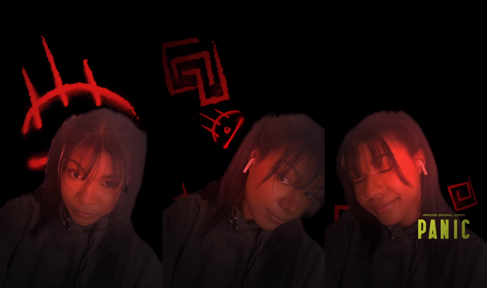

<!-- ### A wallpaper series using shapes and light by [Jean-Marc Denis](http://jmd.im/black) -->

For this face filter, I was tasked to bring a designed filter to life for Amazon's PANIC!. With the assistance of a fellow graphic designer and the rest of team, I was given a well designed storyboard via Photoshop. With the PSD, I broke down the elements separately to save them out as usable PNGs.
Using Spark AR's node system, I created the lighting and coloring effects to give the flickering dark look with a red hue. A particle system was utilized to create the flying symbols in the scene as well. Using face tracking, the particle system's physics is altered by changing their direction of birth based on the location of the user's face. Total turnaround time for this filter was 2 weeks.

On a mobile device, you can try out the filter <a href="https://www.instagram.com/ar/210739440711360" target="_blank">here</a>.

    
    <a href="https://www.instagram.com/ar/210739440711360" target="_blank" style="position:absolute; top:50%; left:50%; transform:translate(-50%,-50%); filter: drop-shadow(5px 5px 5px #000); font-weight:700; color:white; text-decoration:none;">Tap to view</a>

