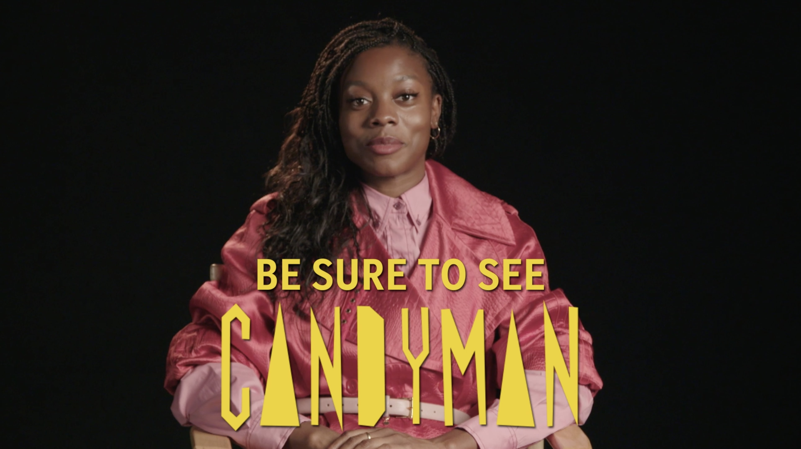

This creative was rendered using a combination of Premiere, After Effects, Photoshop, and Audition. I created a cutdown version of the footage to meet the 1 minute specification. 
The text cards were Designed using photoshop and animated using After Effects. Final video effects were also done within after effects. The piece's audio was finalized within Audition to mixdown the dialogue, music, and sound effects.

    
    <a href="https://www.instagram.com/p/CTDXToWhh73/" target="_blank" style="position:absolute; top:50%; left:50%; transform:translate(-50%,-50%); filter: drop-shadow(5px 5px 5px #000); font-weight:700; color:white; text-decoration:none;">Click to view</a>

