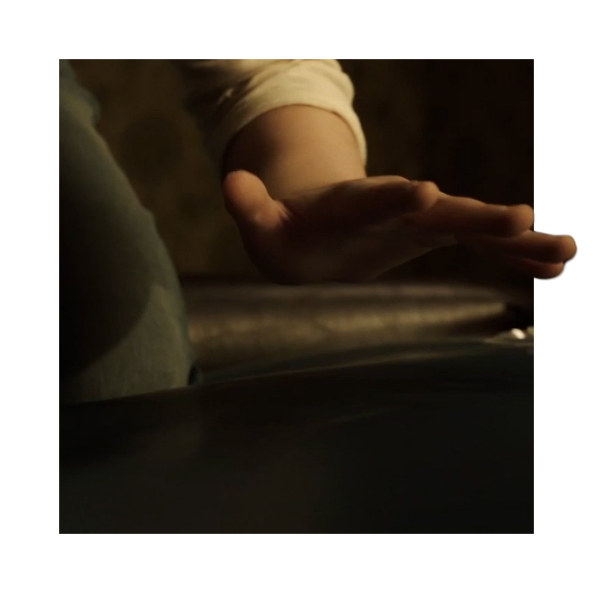
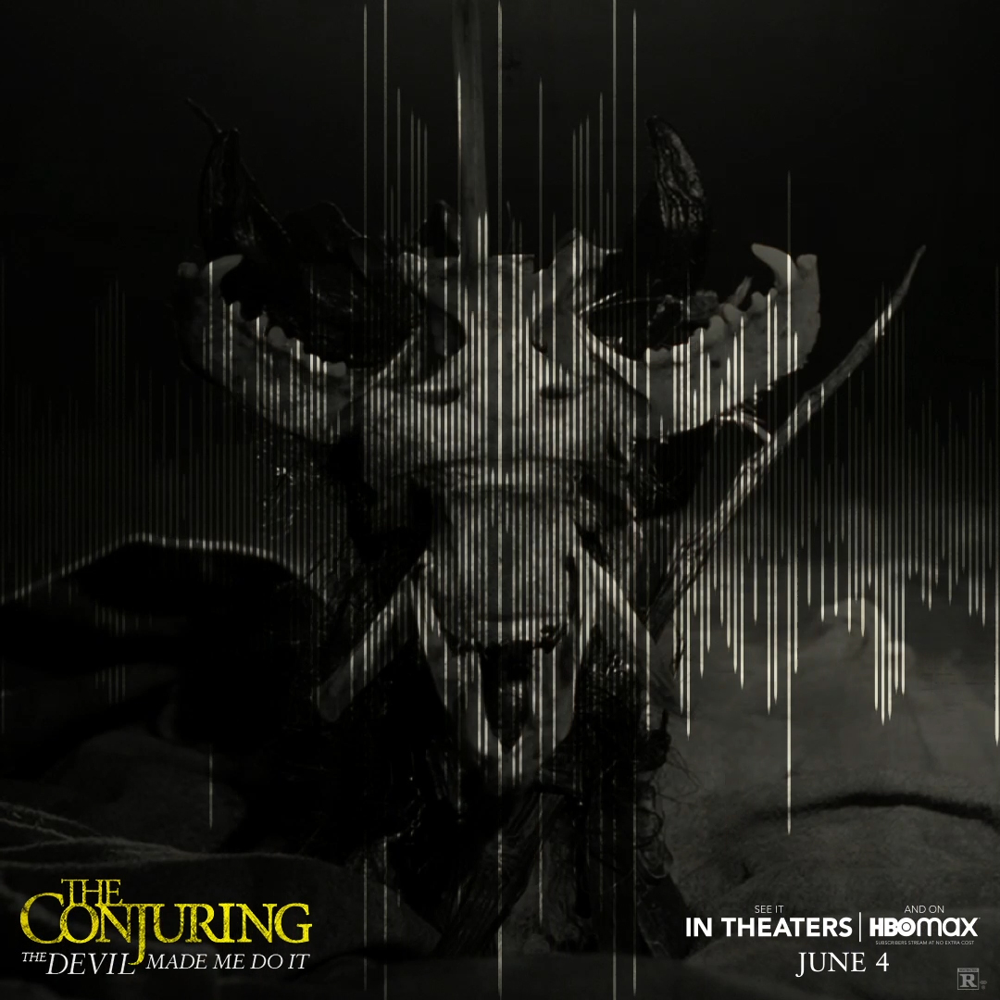
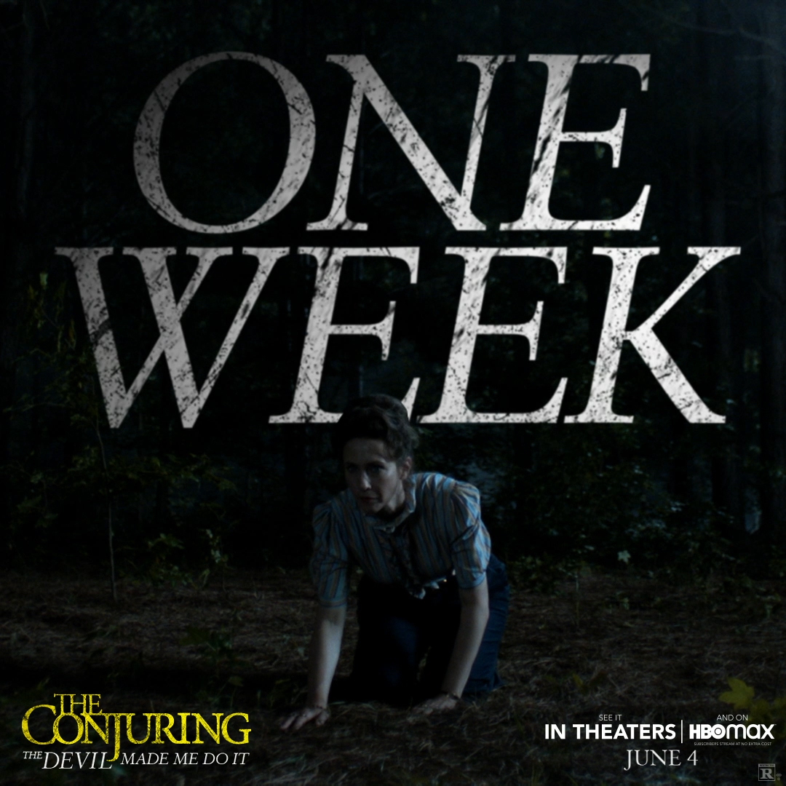

These creatives were made using a combination of After Effects, Photoshop and Audition. These pieces and many others that I have worked on can be found on The Conjuring's <a href="https://www.instagram.com/theconjuring/?hl=en" target="_blank">Instagram</a>.
<p.>

    
    <a href="https://www.instagram.com/p/CSKWjvxtZEU/" target="_blank" style="position:absolute; top:50%; left:50%; transform:translate(-50%,-50%); filter: drop-shadow(5px 5px 5px #000); font-weight:700; color:white; text-decoration:none;">Click to view</a>

    
    <a href="https://www.instagram.com/p/CP3m3RGLC16/" target="_blank" style="position:absolute; top:50%; left:50%; transform:translate(-50%,-50%); filter: drop-shadow(5px 5px 5px #000); font-weight:700; color:white; text-decoration:none;">Click to view</a>

    
    <a href="https://www.instagram.com/p/CPbNKs1lZD9/" target="_blank" style="position:absolute; top:50%; left:50%; transform:translate(-50%,-50%); filter: drop-shadow(5px 5px 5px #000); font-weight:700; color:white; text-decoration:none;">Click to view</a>

