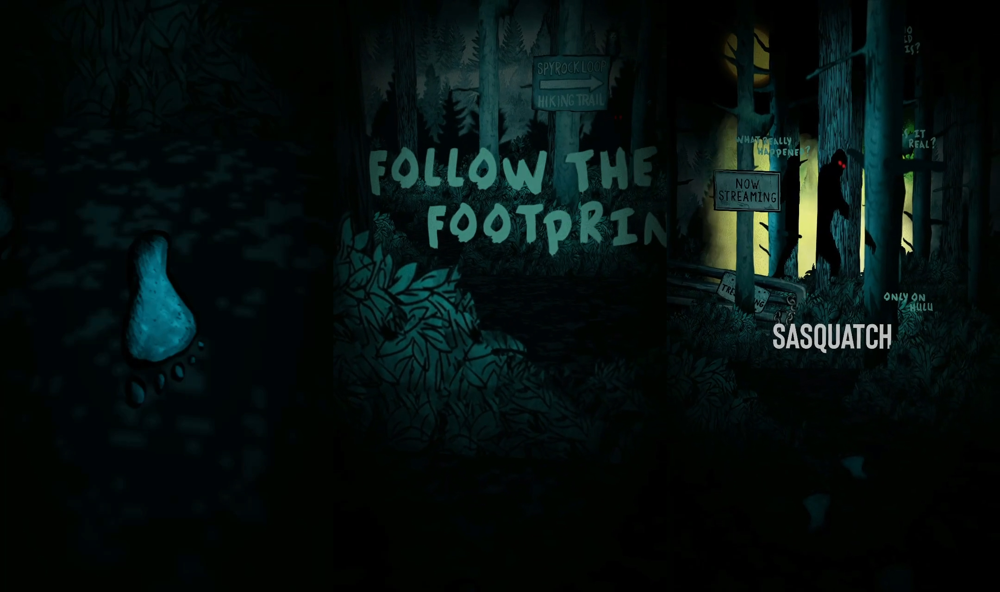

<!-- ### Picasso had his pink period and his blue period. I am in my blonde period right now. -->

This was my first attempt at building a world filter for a client. In this case, I had to construct a world filter using the audio and visuals from Hulu's Sasquatch. I had a producer and motion designer assist me in gathering the 2D assets and audio for the filter. 
Using Photoshop and After Effects, I saved out various assets such as GIFs and PNGs to be used to create the text and environment. Within Spark AR, I used the node system to program the animations such as the leaves flying around, the smoke, triggering sounds when the user is at a specific location, and text tracking.

On a mobile device, you can try out the filter [here](https://www.instagram.com/ar/471294677444555).

