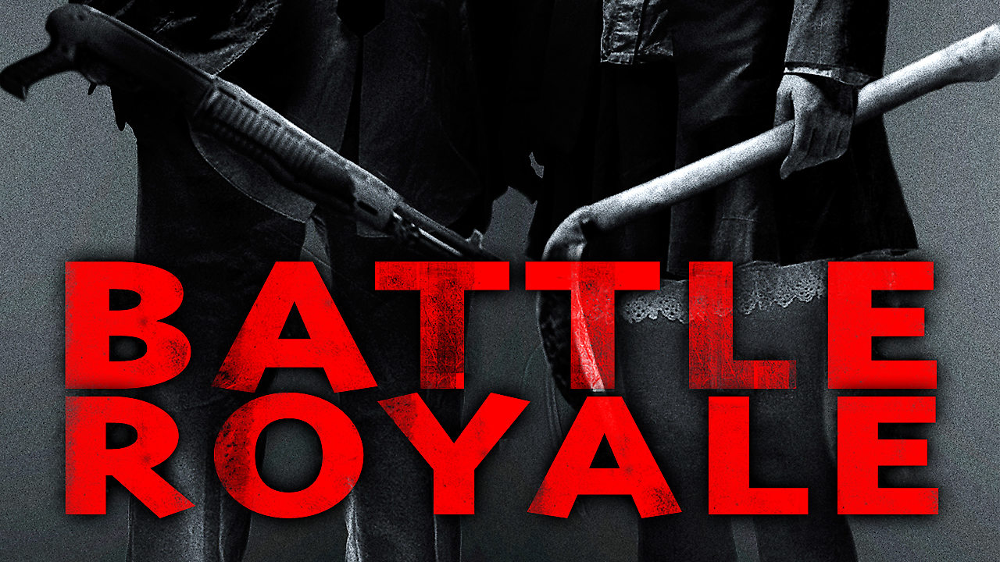

Notable teams that I have made mixes for include Kaba Modern, Common Ground, Underground, Carson Streetdance, Cerritos High School, Tustin High School, Emanon, and URMO. Videos of these performances can be found throughout Youtube and Facebook.

Below is a link to a performance by Common Ground based on the Japanese movie, Battle Royale. I produced the mix using various songs, sampled beats, and dialogue from the movie.

