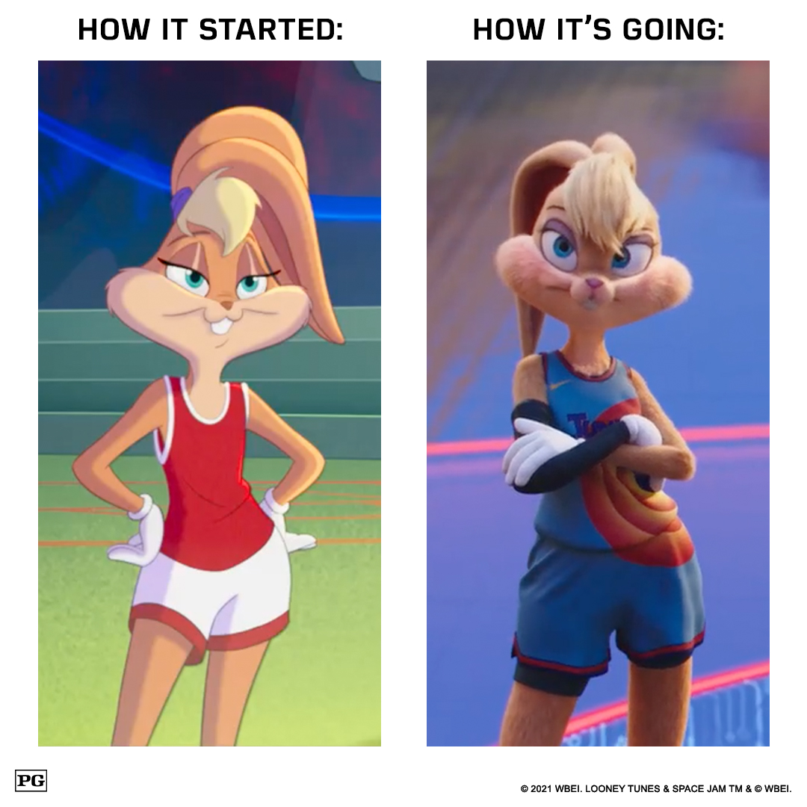

These pieces and many others that I have worked on can be found on Space Jam's <a href="https://www.instagram.com/p/CTXwUNTlszf/" target="_blank">Instagram</a> and <a href="https://twitter.com/spacejammovie/status/1438925758186020868?s=20" target="_blank">Twitter</a>.

    
    <a href="https://www.instagram.com/p/CTXwUNTlszf/" target="_blank" style="position:absolute; top:50%; left:50%; transform:translate(-50%,-50%); filter: drop-shadow(5px 5px 5px #000); font-weight:700; color:white; text-decoration:none;">Click to view</a>

    
    <a href="https://twitter.com/spacejammovie/status/1438925758186020868?s=20" target="_blank" style="position:absolute; top:50%; left:50%; transform:translate(-50%,-50%); filter: drop-shadow(5px 5px 5px #000); font-weight:700; color:white; text-decoration:none;">Click to view</a>

